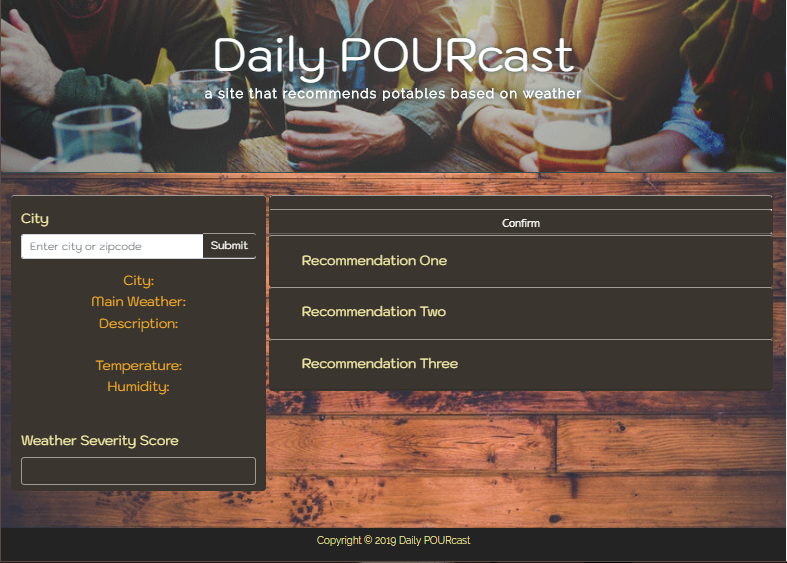
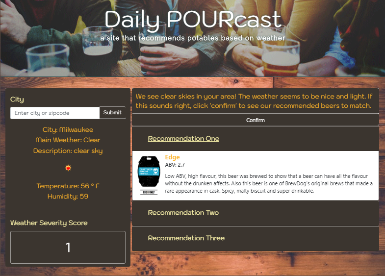

# Daily POURcast
#### Rain or Shine, We've got the perfect beer for you!
* [Project Link](https://johnpgeipel.github.io/Awesome_Project/)
* [YouTube Link](https://www.youtube.com/watch?v=4_V07mbG834&feature=youtu.be)
* [Powerpoint Download Link](https://github.com/johnpgeipel/Awesome_Project/blob/master/Daily%20POURcast.pptx?raw=true)

## Team Members:
* [Christian Livick](https://github.com/cclivick)
* [Joe Dorau](https://github.com/joedorau)
* [Bryan Thusius](https://github.com/bryanthuz)
* [John Geipel](https://github.com/johnpgeipel)

## Project Description:
Our application utilizes the weather forecast data for a user's location and recommends three beers of appropriate potency. For instance, if the forecast is **sunny and warm**, perhaps a **Light Shandy or Pilsner**. If the weather is **dreary or soggy**, try a **Barley Wine or a Barrel-Aged Porter**.

 In the future, we hope to incorporate a news web-scraping function. The user would be able to click on the daily news articles to read brief abstracts of the day’s news in addition to the local forecast. This will provide the user with a better understanding of why they were recommended these particular beers. 

## Technologies Used:
HTML, CSS, Bootstrap, Javascript, JQuery, API's, AJAX & JSON. 

## API’s Used:
* We used **“Punk API”** for the information regarding beer potency and type.
* We used the **"Openweather API"** for the weather forecast information from which we generated a "Weather Severity Score."

## Screenshots

<!-- ## Breakdown of Tasks:
Gather API data, analyze JSON, etc.
Create user interface
Write script -->
